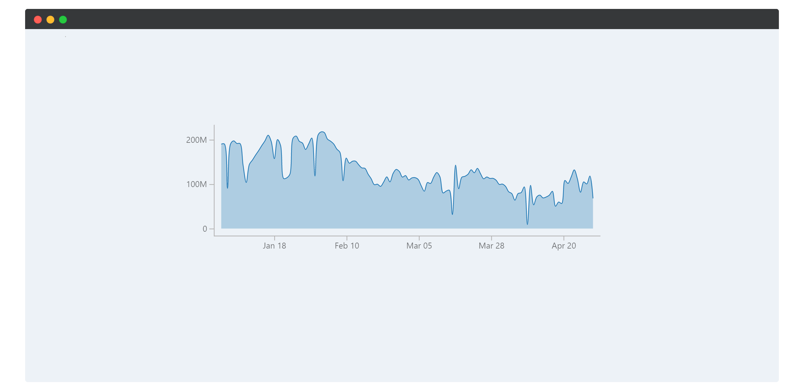

# Привет!👋

## Прежде всего
**web-chart** - это мой пэт-проект для более глубокого понимания javascript и typescript. Если Вам кажется что что-то не так, проект слишком сырой и странно реализованный, то:
- Во-первых, Вам кажется
- А во-вторых, когда кажется, креститься надо
И вообще, если проект ещё не заброшен, то это уже чудо:tada:

## О проекте
**web-chart** - библиотека для web-сайтов и приложений написанная на js и ts



Назначение **web-chart** в визуализации статистики в виде: 
- графиков
- диаграмм
- матриц
- карт
- картограмм
- инфографики

## Пример
Для начала просто добавьте в любое место Вашей страницы:
```html
<div class="chart"></div>
```

Теперь мы можем использовать этот блок для создания графика:
```js
element = document.querySelectorAll(".chart")[0];
let my_chart = new LineChart(element, [1, 3]);
```

## TODO
1. Line Chart - линейные графики
   - [x] Создать тестовый класс LineChart для отображения линейных графиков
   - [ ] Вынести созрание холста в базовый класс
   - [ ] Перейти на ts для более основательной разработки
   - [ ] Разработать дизайн-код для визуализации
   ...
   - [ ] + настроку цветов для линий и точек
   - [ ] + всплывающие подсказки при наведении
2. Bar Graph 

## Thanks
>Я надеюсь, что мой проект будет полезен Вам в визуализации статистики на сайте или в приложении

>P.S. временную картинку я стырил вот у этого крутого [чела](https://github.com/jens-ox)